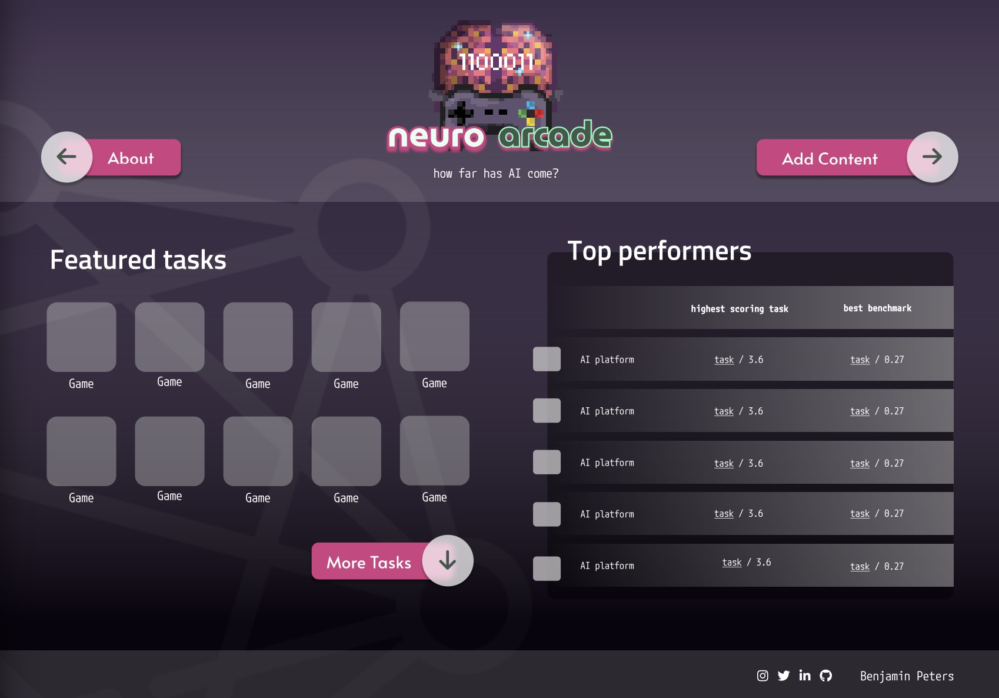
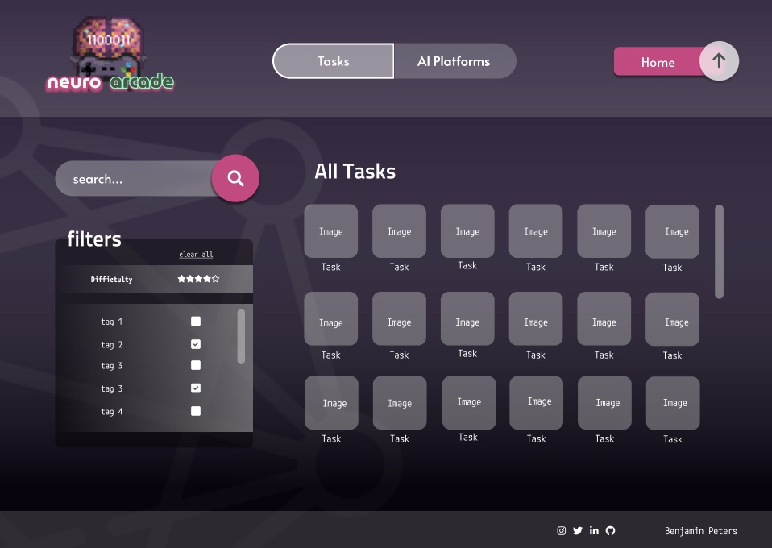
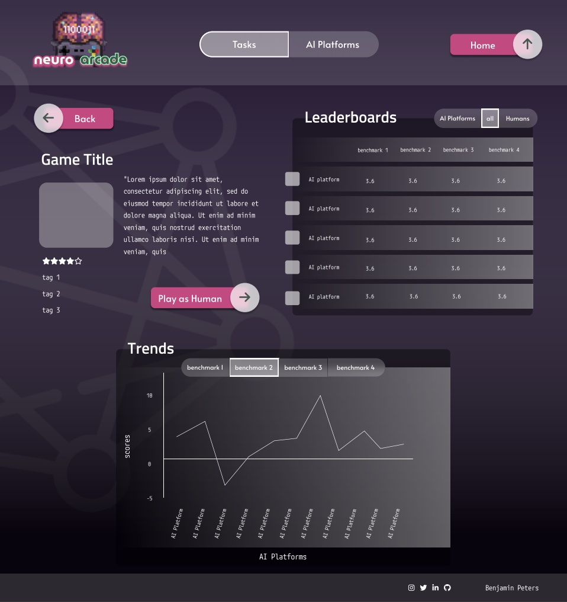

# NeuroArcade

## Description
NeuroArcade is a web project developed by SH08 as part of the Professional Software Development course at the University of Glasgow. The website will allow for a centralised system to record the results of AI models in Games and for a direct comparison with other models. Models will be ranked comparatively (How similar to humans) and competitively (Performance compared to other models).

The ultimate goal is to help make cognitive science more openly collaborative.

## Visuals
See wireframes below for an idea of what some of the completed pages will look like.

### Home Page

### All Games Page

### Individual Games Page

## Installation
The project can currently only be run locally. To run it git clone the project locally and run the following commands.

1. python manage.py makemigrations
2. python manage.py migrate
3. python populate.py
4. python manage.py runserver

## Support
For any help or support, please create an issue on GitLab or message one of the contributors on Microsoft Teams. 

## Contributing
Not currently accepting contributions from external contributors.

## Authors and acknowledgment
Key Contributors to this project:
- Dr Benjamin Peters
- Nour Sameh Mohamed Hosni Elfangary
- Andrei Ghita
- Daniel Hally
- Nathan Logie
- Eilidh Macdonald
- Anzela Tariq
- Christopher Gunn

## License
NeuroArcade is licensed under the MIT open source license.

## Project status
This project is under active development which will continue until April 2024 at the earliest.
