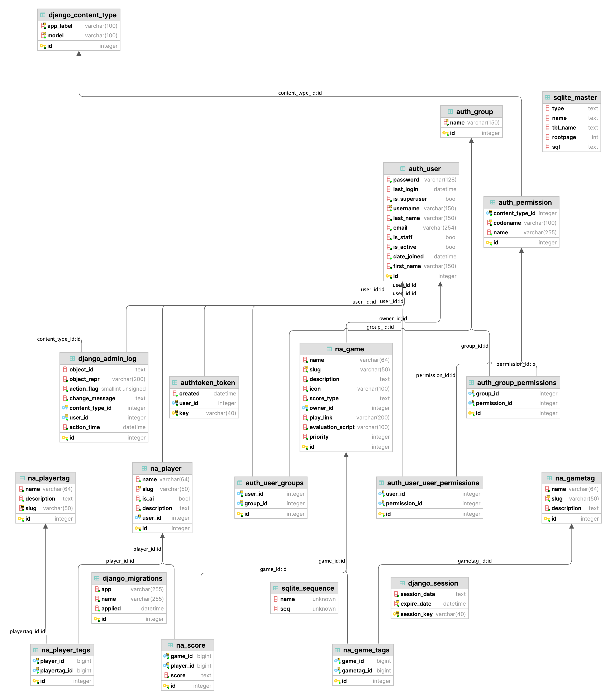

<h2 style="text-align: center;"> Database Models </h2>
<h3 style="text-align: center;"> Game </h3>

Game is the database representation of the game's uploaded to the
site and is linked to the player class through the use of the score model. It has the following fields
   
Name - The name of the game stored as a string with the max length of 64 characters.  
Slug - The name field slugified primarily for use in URLS, must be unique.  
Description - A field to describe the game stored as a string with the max length of 1024 characters.
Owner - The user who owns the game stored as an instance of the django inbuilt user class.  
Icon - An image to represent the game.
Tags - Tags that describe the Game stored as an instance of the GameTag model. Many-to-Many relationship as a tag can
be on multiple games and each game can have multiple tags.  
Score Type - A JSON defining how the scores for that game should be formatted.  
PlayLink - A URL to an external website where you can play the game.  
Evaluation Script - The python script which transforms the unprocessed result data into the score type appropriate for
the game.  
Priority - An admin feature which allows them to define how featured the game is stored as integer.  

<h3 style="text-align: center;"> GameTag </h3>
The gameTag field is the database representation of the game tags attached to the games via the aforementioned many-to-many relationship. The gameTags have the following fields:   
Name -  The name of the tag stored as a string with a max length of 64.  
Slug - The slugified version of the name field primarily used for URL management and as a pseudo primary key to ensure uniqueness.  
Description - The description of the tag which is stored as a string with a max length of 1024 characters.  

<h3 style="text-align: center;"> Player </h3>
The database representations of the players of the games. These can either be Human players or AI players in order to allow for comparison between the two. This has the following fields:  

Name - The player's name stored as a string with the max length of 64 characters.
Slug - The slugified version of the name field primarily used for URL management and as a pseudo primary key to ensure
uniqueness.  
Is Ai - A boolean field determining if the model represents a human or AI player. By default, it is set to false meaning
a human player.  
User - The user behind the player, this is not a one-to-one relationship as a user can have multiple players.
Description - A description of the player, set as a way for users to give more detail about their models via the model's
page. Stored as a string with a max length of 1024 characters.  
Tags - Tags that describe the player stored as an instance of the PlayerTag model. Many-to-Many relationship as a tag
can be on multiple games and each game can have multiple tags.  
Icon - An image to represent the player.  

<h3 style="text-align: center;"> PlayerTag </h3>
The PlayerTag model is the database representation of the player tags attached to the player via the aforementioned many-to-many relationship. The PlayerTags have the following fields:   
Name -  The name of the tag stored as a string with a max length of 64.  
Slug - The slugified version of the name field primarily used for URL management and as a pseudo primary key to ensure uniqueness.  
Description - The description of the tag which is stored as a string with a max length of 1024 characters.  

<h3 style="text-align: center;"> Score </h3>
The database representation of the score's after they have been processed by the evaluation scripts. They have the following fields:    
Score - The JSON representing the processed score used for displaying on site.  
Player - A foreign key instance of the Player model representing the player whose score this is.  
Game - A foreign key instance of the Game model representing the game this score was uploaded for.  

<h3 style="text-align: center;"> Unprocessed Results </h3>
The database representation of the unprocessed results from games to be processed using a game's evaluation script into an instance of the Score model. The instances of data will be deleted after processing.
This model contains the following fields:   
Upload Date - The date and time the data was uploaded for internal use in tracking uploads and prioritising older uploads.  
Content - A text field containing the unprocessed data.  
Player - A foreign key instance of the Player model representing the player who uploaded this data.  
Game - A foreign key instance of the Game model representing the game this data was uploaded for.  
Status - An integer field tracking the current status of the results with 0 meaning still to be processed, 1 meaning processing, and 2 meaning error during processing.  
Errors - A text field containing any errors raised during processing.  

<h3 style="text-align: center;"> User Status </h3>
The database representation of a user's status, this is primarily used by admins to distinguish other admins and the different states of users. It contains the following fields:   
Status - A char field with the following possible values: Approved - Meaning the user can view and upload games/data, Pending - Meaning the user has only recently signed up and needs admin approval for uploading games/scores, Blocked - Meaning the user can no longer log in.  
User - An instance of the django inbuilt user class which this status links to.

<h3 style="text-align: center;"> Visual representations </h3>
See below for a visual representation of the database and the database dependencies.  

