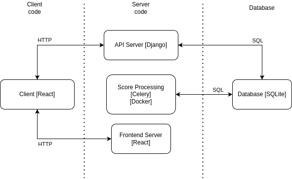

### Client [React]

Our client uses React JS to provide modularity for the frontend of the website. 
It helps with separation of concerns and makes the structure of the code easier to understand. 
It does so through the use of components. 

Components return a JSX element. JSX is an extension of the javascript language commonly used in React projects,
and it contains HTML like elements. It allows for the creation of DOM trees.

Each page in our app corresponds to a component in our app directory.
Helper components are located in the component directory.

Our React App handles URLs using react-router-dom (see [index.js](../neuro_arcade/reactapp/src/index.js)).
It creates routes to each page then renders the documents.

[More on the React Client](client.md)

### API Server [Django]

Our API server is the main point of communication between our database and our client.
It takes a http request - most commonly a 'POST' or 'GET' request - and alters/creates/retrieves 
instances from the database depending on the request. 

For 'POST' requests, the request holds data to be altered. It then retrieves an existing model,
or creates a new one depending on what is needed to be posted. It returns a success response if 
the new attribute or instance was successfully added to the database, otherwise it returns an error 
response.

For 'GET' requests, the request holds data on the instance to retrieve. It then 
searches for that data in the database or in a json file. Once the data is retrieved,
it returns a success response, containing the instance. In cases where the instance is not 
found, it returns an error response with status 404. 

There are also permission classes such as IsAdminUser and IsAuthenticated. These ensure that 
only requests containing the required features are accepted, otherwise it returns a forbidden response.
These prevent any security risks that may occur.

For making request on the client, the Axios library is used, which streamlines the process of making http requests 
to the API server. API requests are sent from our React JS client via Axios http requests (see [backendRequests.js](../neuro_arcade/reactapp/src/backendRequests.js)).
Our django server receives this data and does the appropriate actions (see [views.py](../neuro_arcade/na/views.py)).

[More on the Django API Server]

### Score Processing [Celery + Docker]

This regards the process and processing of game scores and the components involved in them.
The server returns unprocessed data which must be in a json format. 

There are two ways in which data is collected; the first is through the server's API: 
once a user has played a game, the scores are automatically collected and sent. 
The second is by batch-upload: users have the option to batch upload scores for 
their own AI bots.

[More on Score Processing](score_pipeline.md)

### Frontend Server [Serve]

Our frontend server provides precompiled React files to users. It sends the React client to 
the clients.

### Database [SQLite]

Our database runs with SQLite. It helps to structure our data and provides relationships between
related data. Our backend uses Django models to assemble this information (see [models.py](../neuro_arcade/na/models.py)).

Each model contains a number of attributes, with one or more of the attributes acting as a 
primary key. A primary key is a unique attribute specific to individual models. This is how we identify 
each instance. 

There are three types of relationships a model can have: one-to-one, one-to-many, and many-to-many. A one-to-one
relationship links one instance of one model to another instance of a different model. A one-to-many relationship links
one instance to many instances of another model. For example, a user has one status: pending, blocked or approved. 
But multiple users can have the same status. This is a one-to-many relationship. 

A many-to-many relationship links many instances of a model to many instances of another. For example,
one game can have multiple tags and a tag can relate to multiple games.

Models are related through foreign key in our database. A foreign key is a primary key of another model.

This structure allows us to easily access and manipulate relevant data for our app.

[More on our database]

